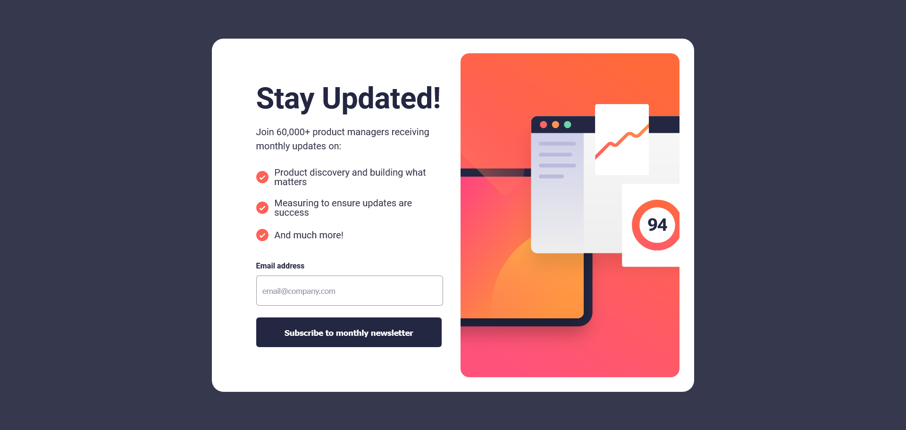
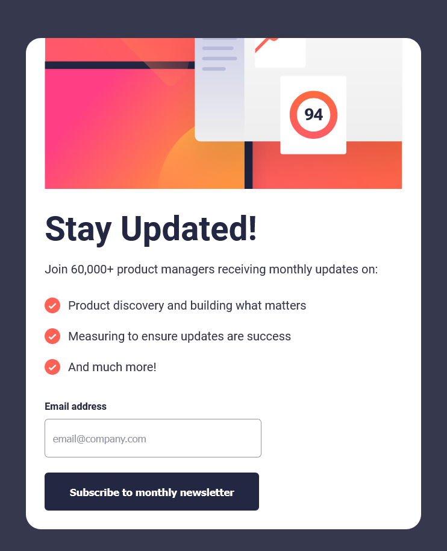
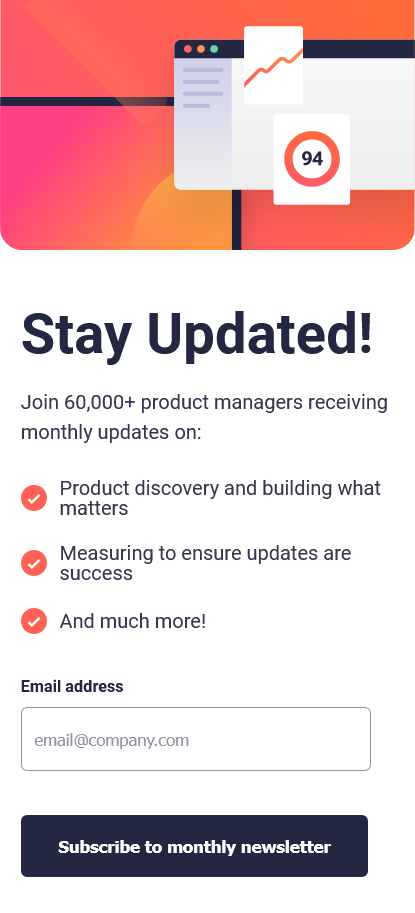
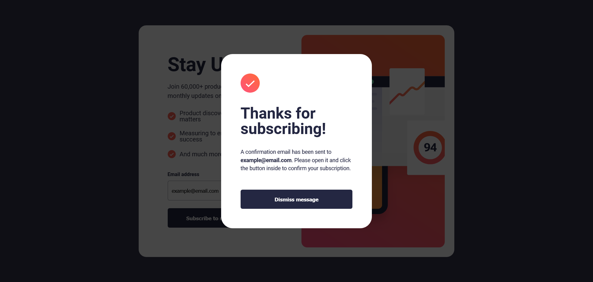
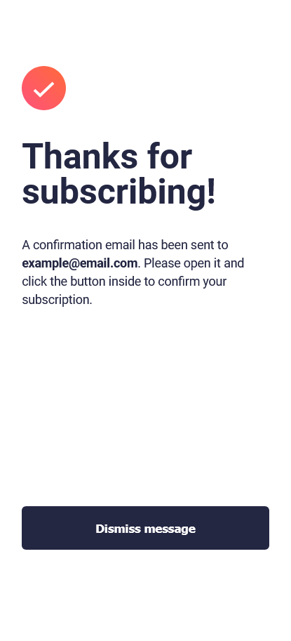
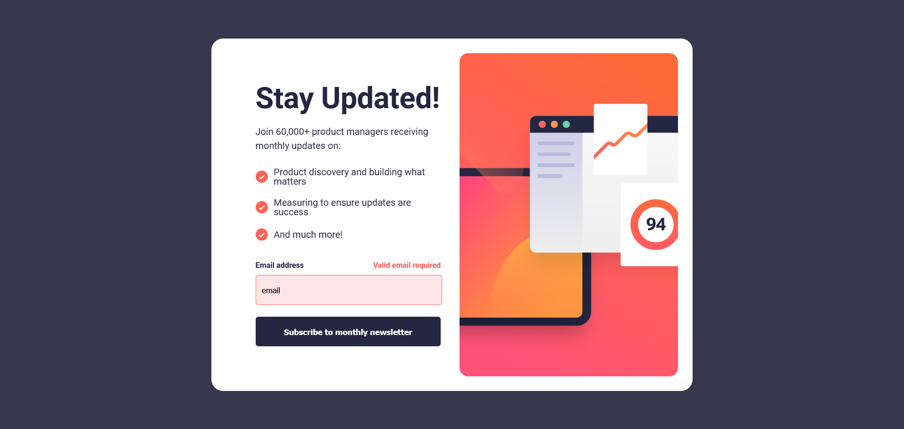

# Frontend Mentor - Newsletter Sign-up Form with Success Message Solution

This is my solution to the [Newsletter sign-up form with success message challenge on Frontend Mentor](https://www.frontendmentor.io/challenges/newsletter-signup-form-with-success-message-3FC1AZbNrv). This challenge allowed me to refine my skills in HTML, CSS, and JavaScript while focusing on responsiveness and interactivity.

---

## Table of Contents

- [Frontend Mentor - Newsletter Sign-up Form with Success Message Solution](#frontend-mentor---newsletter-sign-up-form-with-success-message-solution)
  - [Table of Contents](#table-of-contents)
  - [Overview](#overview)
    - [The Challenge](#the-challenge)
    - [Screenshots](#screenshots)
    - [Links](#links)
  - [My Process](#my-process)
    - [Built With](#built-with)
    - [What I Learned](#what-i-learned)
    - [Challenges Faced](#challenges-faced)
  - [Author](#author)

---

## Overview

### The Challenge

Users should be able to:
- Add their email and submit the form.
- See a success message with their email after successfully submitting the form.
- View form validation messages when:
  - The email input is empty.
  - The email format is invalid.
- See an optimized layout for different screen sizes.
- Experience hover and focus states for all interactive elements.

### Screenshots

Here are some screenshots showcasing the design and functionality across various devices:

**Desktop View**  


**Tablet View**  


**Mobile View**  


**Confirmation Message (Desktop)**  


**Confirmation Message (Mobile)**  


**Validation Error**  


### Links

- Solution URL: (https://github.com/Bilal-MEKIRI/newsletter-signup-form)
- Live Site URL: (https://newsletter-signup-form-femc.netlify.app/)

---

## My Process

### Built With

- Semantic **HTML5** for structured markup.
- **CSS** for styling and layout:
  - Responsive design using **Flexbox** and media queries.
  - A desktop-first workflow, refining for smaller screens via breakpoints.
- **JavaScript** for interactivity:
  - Custom validation using regular expressions.
  - Dynamic success message implementation.
  - Responsive image switching based on screen size using JavaScript.

### What I Learned

This project provided several key takeaways:
1. **Responsive Image Handling with JavaScript**  
   I implemented a function to dynamically switch images based on screen size. This helped me understand how to use event listeners for `resize` events effectively.  
   ```javascript
   function updateImage() {
     if (window.innerWidth <= 815) {
       imageElement.src = mobileImage;
     } else {
       imageElement.src = desktopImage;
     }
   }
   window.addEventListener("resize", updateImage);
   ```
2. **Custom Success Message Popup**
   Instead of using the default `alert()`, I created a custom popup message. This allowed me to maintain consistent styling with the provided design.

    The popup dynamically displays the user's entered email using JavaScript:
    ```javascript  
    emailSpanElement.textContent = emailInput.value;
    ```

3. **Regex for Form Validation**
   I learned how to validate email input using regex and provide meaningful feedback to users:
   ```javascript 
   const emailRegex = /^[^\s@]+@[^\s@]+\.[^\s@]{2,}$/;
   ```

4. **Component-Specific CSS**
   Breaking the CSS into smaller, component-specific files improved readability and maintainability. This is a practice I’ll adopt in future projects.


### Challenges Faced

- **Creating a Custom Popup Message**
  This was the first time I created a custom popup from scratch. Initially, I thought about using a simple `alert()`, but I quickly realized that alerts aren’t customizable and their appearance depends entirely on the browser. That wasn’t going to work for this design, so I had to build my own. I used a `div` overlay with adjustable opacity for the backdrop and added a toggle class using JavaScript to control its visibility. It was a great learning experience, and I’m happy with how it turned out!
   
- **Responsive Design Workflow**
  I started with a desktop-first approach, but as I worked on making the design responsive, I ended up adding too many breakpoints to adjust for smaller screens. It felt a bit messy, so I want to figure out a better way to simplify this process in the future without relying on so many media queries.

## Author

- Frontend Mentor - [@Bilal-MEKIRI](https://www.frontendmentor.io/profile/Bilal-MEKIRI)
